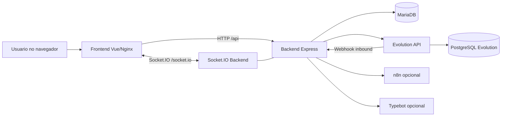
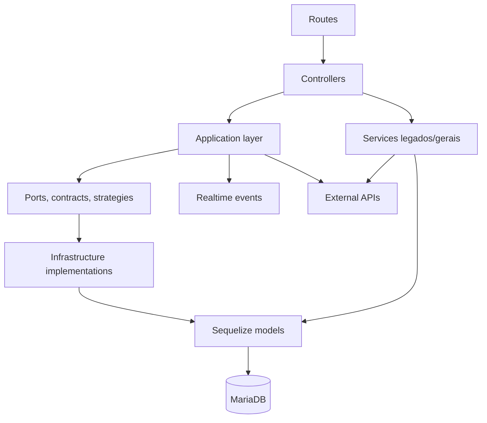
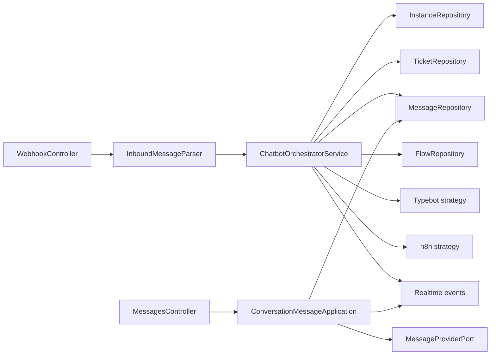
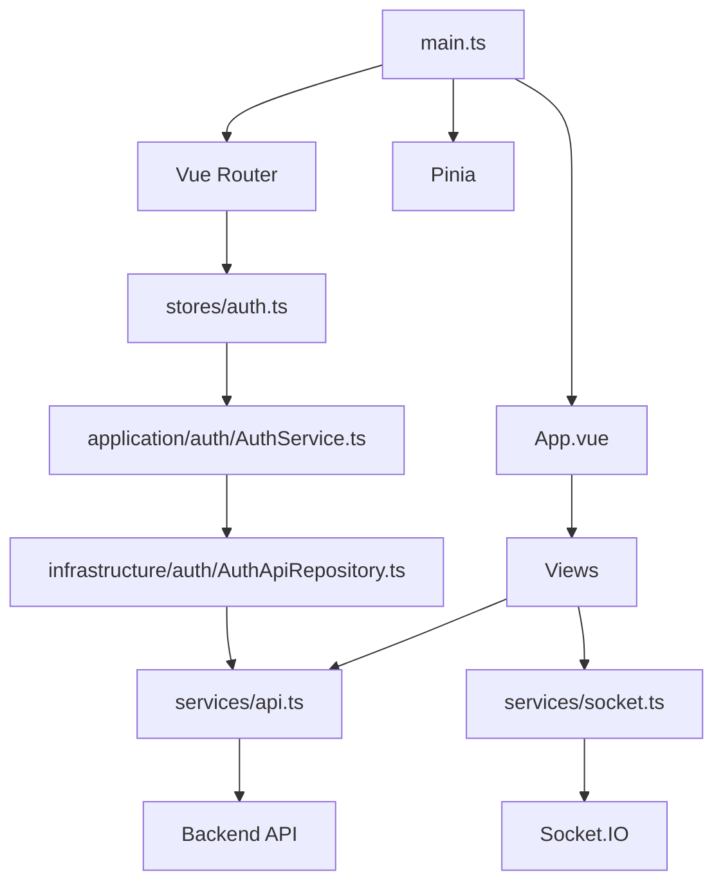

# Arquitetura do WHATS_AUTO

Este documento descreve a arquitetura tecnica do projeto, as principais camadas e os motivos das decisoes estruturais.

## Objetivos arquiteturais

A arquitetura foi organizada para atender estes objetivos:

- **Separar interface, regra de negocio e infraestrutura.**
- **Isolar integracoes externas**, especialmente Evolution API, n8n e Typebot.
- **Manter o dominio de conversas compreensivel**, pois ele e o nucleo do produto.
- **Permitir evolucao incremental**, sem exigir refatoracao completa do legado.
- **Facilitar onboarding**, com mapas claros de onde cada responsabilidade mora.
- **Simplificar operacao**, usando uma stack Docker reduzida para deploy direto.

## Visao geral



### Responsabilidades por bloco

| Bloco | Responsabilidade |
|---|---|
| Frontend Vue | Interface operacional, fila, administracao, autenticacao e consumo realtime |
| Backend Express | API HTTP, autenticacao, regras de negocio, integracoes e eventos |
| Socket.IO | Atualizacao realtime por empresa, usuario e ticket |
| MariaDB | Dados principais do sistema |
| Evolution API | Conexao com WhatsApp, webhooks e envio de mensagens |
| PostgreSQL Evolution | Persistencia interna da Evolution API |
| n8n/Typebot | Automacoes opcionais |

## Backend em camadas



### 1. Entrada HTTP

Arquivos principais:

- `backend/src/app.ts`
- `backend/src/server.ts`
- `backend/src/routes/index.ts`

Responsabilidades:

- configurar Express, CORS, Helmet, JSON parser e Swagger;
- inicializar HTTP e Socket.IO;
- declarar rotas publicas e protegidas;
- aplicar middlewares de autenticacao e autorizacao.

Motivo:

- a entrada HTTP deve ser previsivel e facil de auditar;
- seguranca e autorizacao precisam estar visiveis perto das rotas.

### 2. Controllers

Pasta:

```text
backend/src/controllers/
```

Responsabilidades:

- adaptar HTTP para chamadas internas;
- validar entrada simples;
- delegar para camada de aplicacao ou services;
- responder status HTTP e JSON.

Motivo:

- controllers sao uma camada de borda;
- nao devem concentrar regra de negocio complexa;
- isso evita acoplamento entre dominio e Express.

### 3. Application layer

Pasta principal:

```text
backend/src/application/chatbot/
```

Responsabilidades:

- orquestrar casos de uso do dominio de conversas;
- definir contratos de persistencia e provedores;
- separar estrategias de automacao;
- manter fluxo inbound/outbound legivel.

Motivo:

- conversa/mensagem e o nucleo do produto;
- esse modulo precisa ser mais testavel e menos dependente de framework;
- o formato de payload da Evolution ou a tecnologia de banco nao devem vazar para toda a aplicacao.

### 4. Services

Pasta:

```text
backend/src/services/
```

Responsabilidades:

- regras gerais ja existentes;
- bootstrap;
- administracao e management;
- integracoes externas;
- compatibilidade com Evolution API.

Motivo:

- o projeto evoluiu inicialmente com services;
- manter essa camada reduz risco de refatoracao grande;
- novos dominios centrais podem ser extraidos gradualmente para `application/`.

### 5. Infrastructure

Pasta:

```text
backend/src/infrastructure/
```

Responsabilidades:

- implementar portas tecnicas;
- encapsular Sequelize;
- controlar transacoes;
- concentrar queries concretas de repositorio.

Motivo:

- persistencia e detalhe tecnico;
- separar infraestrutura permite testar dominio com mocks/fakes.

## Dominio chatbot



### Por que esse dominio foi separado

Esse fluxo tem muitas responsabilidades sensiveis:

- entender payload externo;
- garantir multi-tenant;
- criar ou reutilizar ticket;
- persistir mensagem;
- emitir realtime;
- acionar automacoes;
- enviar resposta pelo provedor.

Se tudo isso ficasse em controller ou service generico, o codigo ficaria dificil de testar e evoluir. Por isso o dominio foi separado em parser, application service, repositories, providers e strategies.

## Frontend



### Organizacao do frontend

| Camada | Responsabilidade |
|---|---|
| `views/` | Paginas completas e orquestracao de tela |
| `components/` | UI reutilizavel, layout e componentes base |
| `stores/` | Estado global compartilhado |
| `services/api.ts` | Cliente HTTP configurado com JWT |
| `services/socket.ts` | Cliente Socket.IO e listeners realtime |
| `application/auth/` | Caso de uso de autenticacao no frontend |
| `infrastructure/` | Implementacoes Axios/storage |

### Rotas principais

| Rota | View | Perfis |
|---|---|---|
| `/login` | `Login.vue` | Publico |
| `/` | `Dashboard.vue` | admin, manager |
| `/tickets` | `Tickets.vue` | admin, manager |
| `/operator/queue` | `OperatorQueue.vue` | agent, viewer |
| `/instances` | `Instances.vue` | admin, manager |
| `/settings` | `Settings.vue` | admin, manager |
| `/builder` | `TypebotBuilder.vue` | admin, manager |
| `/admin/users` | `AdminUsers.vue` | admin, manager |

## Banco de dados

Entidades principais:

- `Company`
- `User`
- `Instance`
- `Ticket`
- `Message`
- `Flow`
- `FlowWorkspace`
- `MessageTemplate`
- `BotConfig`

As associacoes ficam em:

```text
backend/src/models/index.ts
```

Motivo:

- centralizar relacionamentos evita divergencia entre queries;
- facilita entender o modelo multi-tenant;
- deixa claro que quase tudo pertence a uma `Company`.

## Realtime

Pasta:

```text
backend/src/realtime/
```

Eventos principais:

- `server:ticket.created`
- `server:ticket.updated`
- `server:message.created`
- `server:welcome`
- `server:pong`

Salas:

- `company:{companyId}`
- `user:{userId}`
- `ticket:{ticketId}`

Motivo:

- conversas precisam atualizar sem refresh;
- eventos por empresa mantem isolamento multi-tenant;
- eventos por ticket permitem atualizacao direcionada.

## Deploy e CI/CD

Stack recomendada:

- `docker-compose.simple.yml`
- `.env.simple.example`
- `DEPLOY_SIMPLES.md`
- `.github/workflows/ci.yml`
- `.github/workflows/cd.yml`

Decisao:

- o fluxo simples evita GHCR, Slack, Traefik obrigatorio e rollback automatico complexo;
- deploy manual via SSH reduz pontos de falha;
- o servidor constroi localmente com Docker Compose;
- smoke tests verificam apenas saude essencial: `/health` e `/api/health`.

## Direcao de evolucao

Recomendacoes para proximas evolucoes:

1. Criar novos dominios importantes em `backend/src/application/<dominio>`.
2. Reduzir gradualmente services muito grandes.
3. Manter integrations externas atras de providers/strategies.
4. Evitar views gigantes extraindo componentes quando houver repeticao real.
5. Atualizar `docs/UML.md` e `docs/vetores/` quando fluxos centrais mudarem.
